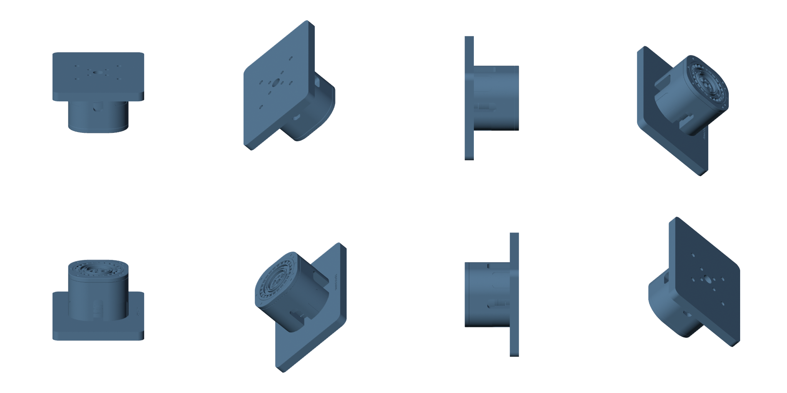
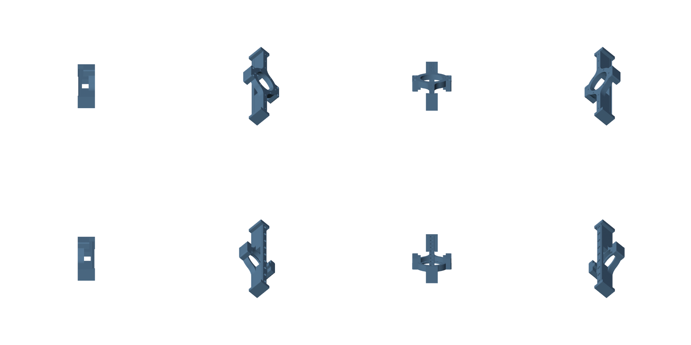

# Midbrain

**An agentic Physical AI runtime for robotics**

Midbrain is an experimental framework for building robotic systems in which AI agents, bounded skills, hardware interfaces, perception services, and shared world state operate through a common runtime.

The project is intended to support the broader robotic agentic workload—not only RGB-D sensing. The current RGB-D camera, visual-inertial pose estimation, CAD-based object-pose tracking, point-cloud viewer, and calibration tools serve as reference implementations of the architecture.

The long-term goal is to provide a reusable foundation for robotic systems that combine:

* Physical sensors
* Robot arms and other actuators
* Local perception and neural-network inference
* Localization, mapping, and tracking
* Persistent real-time services
* Short-lived task skills
* Autonomous and human-directed agents
* Shared spatial and operational state

> **Project status:** Midbrain is under active development. The current repository demonstrates the architecture through an RGB-D and IMU-based spatial cognition stack, policy-enforced control authority, integrated arm motion planning, and a narrowly bounded OpenAI Agents SDK test path. It is not yet a production-certified robotics control system.

The latest system-housecleaning and guarded physical validation are recorded in the [Changelog](CHANGELOG.md), [Build and Validation Report](BUILD_REPORT.md), and [Phase 5 completion record](docs/reference/project_notes/PHASE5_AGENT_SDK_COMPLETION_AND_SHUTDOWN_20260729.md). The work separates durable mechanism from task policy, makes control submissions auditable, adds discoverable Skill and data-route contracts, introduces lease and authorization enforcement, and exercises a decision-only Agents SDK path through reviewed motion.

Cartesian direction understanding remains an open safety and correctness problem. Natural-language directions such as "up", "front", and axis names must not be assumed to map directly across camera, world, arm-base, controlled-frame, tool, and object frames. The current workcell's observed mapping is installation-specific. See [Cartesian Axis and Alignment Open Issue](docs/reference/project_notes/CARTESIAN_AXIS_ALIGNMENT_OPEN_ISSUE_20260729.md).

The vegetable-cutting experiment that motivated part of this validation is retained in the monorepo as a manual-only, non-discoverable experimental Skill. It does not grant autonomous motion authority and is not a production deployment.

---

## Core model

Midbrain separates a robotic system into five primary concepts:

| Concept       | Responsibility                                                                                                       |
| ------------- | -------------------------------------------------------------------------------------------------------------------- |
| **Manager**   | Hosts the systemic dashboard; supervises, discovers, allocates, and coordinates Providers and their resources.       |
| **Fabric**    | Maintains timestamped observations, transforms, shared state, and synchronized access to data produced by Providers. |
| **Providers** | Own hardware devices or persistent computational services and expose stable capabilities through contracts.          |
| **Skills**    | Perform bounded operations that start, use Provider resources, produce a result, and end.                            |
| **Agents**    | Plan, invoke Skills, coordinate Providers, observe the Fabric, and control the overall robotic workflow.             |

This separation allows hardware drivers, real-time services, perception systems, task logic, and agent reasoning to evolve independently.

---

## Runtime architecture

### Manager

The Manager is the control and resource plane of the platform.

It is responsible for:

* Starting and stopping Provider processes
* Monitoring Provider health
* Discovering Provider capabilities
* Routing capability requests
* Managing long-running services
* Coordinating resources shared by multiple Skills or Agents
* Preventing incompatible resource use
* Applying motion-inhibit and safety coordination
* Providing a common hosting model for persistent robotic services

Some robotic workloads cannot be started from scratch for every task. Camera acquisition, robot-arm control, localization, object tracking, mapping, and neural-network inference may need to remain active continuously.

The Manager provides the lifecycle and resource-management layer for these persistent or real-time services.

### World State Fabric

The Fabric is the shared observation and state plane.

It provides:

* Timestamped observation storage
* Stream and capability discovery
* Historical and synchronized data lookup
* Coordinate-frame and transform relationships
* Dynamic robot and sensor poses
* Shared state between Providers, Skills, and Agents
* References to large data stored through transport-specific mechanisms
* A consistent view of the physical system over time

Providers publish observations and state into the Fabric. Skills and Agents consume that information without requiring direct knowledge of every device driver or service implementation.

The Fabric is intended to become the common spatial and operational memory of the robotic system.

### Providers

Providers expose hardware or persistent computation through framework-neutral contracts.

A Provider may represent:

* An RGB-D camera
* An IMU
* A robot arm
* A mobile robot base
* A gripper
* A force or torque sensor
* A local object detector
* A multi-object tracker
* A visual-inertial odometry service
* A mapping or localization service
* A speech or audio subsystem
* A neural-network inference runtime
* A safety controller
* A simulation or replay source

Providers are generally long-lived. They own their device connection, processing state, calibration, health monitoring, and real-time execution requirements.

A Provider should expose capabilities rather than forcing Skills and Agents to depend on a specific brand, SDK, transport, or implementation.

Brand-specific Providers may implement brand-neutral contracts. For example, an Orbbec camera Provider can expose standard RGB-D and IMU capabilities, while a separate pose Provider can consume those observations without depending directly on the Orbbec SDK.

### Skills

A Skill is a bounded robotic operation.

Unlike a Provider, a Skill normally:

1. Starts with a defined goal and input.
2. Requests the capabilities and resources it needs.
3. Reads relevant observations from the Fabric.
4. Commands one or more Providers.
5. Produces a result or status.
6. Releases its resources.
7. Ends.

Examples include:

* Initialize spatial cognition
* Calibrate a camera IMU
* Move a robot arm to a target pose
* Pick up a detected object
* Scan a work surface
* Register a camera to a robot base
* Follow a tracked object
* Capture a synchronized sensor sample
* Inspect a component
* Return a robot to a safe pose

Skills should contain task-specific execution logic while relying on Providers for persistent hardware and computation.

A Skill may coordinate several Providers. For example, a pick operation could use an object-tracking Provider, a pose Provider, a robot-arm Provider, a gripper Provider, and safety state from the Fabric.

### Agents

Agents provide planning, coordination, and higher-level control.

An Agent may:

* Interpret a user or system objective
* Inspect available Provider capabilities
* Select and invoke Skills
* Monitor execution through the Fabric
* Coordinate multiple Skills
* Respond to failures or changing observations
* Maintain task-level context
* Decide when to stop, retry, re-plan, or request assistance

Agents should not need to implement individual device drivers. They operate through Skills, Manager capabilities, Provider contracts, and shared Fabric state.

The platform is intended to support multiple agent implementations rather than requiring a specific AI framework or model provider.

---

## Execution model

Midbrain distinguishes between persistent services and bounded work.

### Persistent and real-time workloads

These are normally implemented as Providers managed by the Manager:

* Sensor acquisition
* Robot-arm communication and control
* Continuous pose estimation
* Object detection and tracking
* Mapping and localization
* Neural-network inference
* Safety monitoring
* Shared hardware access
* High-rate data processing

These services may remain active across many Skill executions.

### Bounded task workloads

These are normally implemented as Skills:

* Calibration procedures
* Robot manipulation sequences
* Inspection tasks
* Data capture operations
* Object pickup or placement
* Initialization and shutdown procedures
* One-time registration or alignment
* Recovery actions

This model avoids restarting expensive or real-time services for every agent action and allows several Skills to use the same managed resources safely.

---

## Current reference implementation

The first integrated Midbrain reference stack focuses on local spatial cognition using an RGB-D camera and IMU.

| Component                  | Path                                                                       | Purpose                                                                                                    |
| -------------------------- | -------------------------------------------------------------------------- | ---------------------------------------------------------------------------------------------------------- |
| Resource Provider Manager  | `platform_core/manager`                                                    | Provider lifecycle, health, capability discovery, request forwarding, and resource coordination            |
| World State Fabric         | `platform_core/fabric`                                                     | Timestamped observations, synchronized lookup, stream discovery, and transform graph                       |
| Contracts                  | `contracts`                                                                | Framework-neutral Provider, Fabric, Skill, calibration, VIO, and safety contracts                          |
| Orbbec Femto Bolt Provider | `providers/orbbec_femto_bolt`                                              | Brand-specific RGB, depth, infrared, point-cloud, IMU, calibration, identity, and static-transform support |
| Local VIO Provider         | `providers/local_vio`                                                      | Brand-neutral camera-plus-IMU pose estimation and dynamic body transforms                                  |
| FoundationPose finite Skill | `skills/foundation_pose_object_localization`                              | Bounded CAD-based 6D pose estimation with explicit estimator and GPU-resource cleanup                       |
| FoundationPose compatibility Provider | `providers/foundation_pose`                                      | Legacy session/stream compatibility and guarded route comparison during migration                           |
| reBot Arm DM Basic Provider | `providers/rebot_arm_dm`                                                  | Hardware-facing seven-motor DM controller with gravity-float, safe-home, fenced leases, payload gravity compensation, and validated motor-command limits |
| reBot Arm Integrated Provider | `providers/rebot_arm_integrated`                                        | Cartesian IK and operator-supervised motion prototype with Manager capability discovery, an Xbox/GUI test drive, gripper control, and Fabric target input |
| Stationary World-Space Arm Finder | `skills/stationary_world_arm_alignment`                                | Finite camera/world/arm-base alignment Skill with FoundationPose and VLM RGB-D modes, source-labeled results, and a monitoring GUI |
| Supervised Vegetable Cutting Skill | `skills/vegetable_cutting`                                           | Manual-only, non-discoverable experimental cutting workflow with explicit operator takeover, reviewed motion gates, and external hard-stop requirements |
| Test Agent                 | `test_agent`                                                               | Separate regular and developer OpenAI Agents SDK surfaces used to exercise the platform                    |
| Midbrain main GUI portal   | `platform_core/manager/web`                                                | Primary system entry for observation, guarded component access, Agents, and shutdown                       |
| Point-cloud and pose GUI   | `test_agent`                                                               | Developer-only live world-frame point cloud, camera pose, reset controls, and estimator diagnostics        |
| IMU calibration GUI        | `providers/orbbec_femto_bolt/python/orbbec_femto_provider/calibration_web` | Six-position accelerometer calibration workflow                                                            |

The current camera Provider publishes large RGB-D payloads through Windows named shared memory and publishes generation-checked references through the Fabric.

The Local VIO Provider consumes ordered IMU history and synchronized camera observations. It maintains a dynamic pose estimate and publishes body transforms into the Fabric.

The finite FoundationPose Skill consumes synchronized RGB-D observations,
target CAD models, and explicit reviewed masks inside a bounded parent
workflow. The compatibility Provider preserves the former independent
tracking/session interface, but it is not the default Stationary Alignment
route and can explicitly release its GPU runtime after a job.

The canonical sanitized reBot B601-DM FoundationPose profile is published under [`providers/foundation_pose/defaults/rebot_b601_dm`](providers/foundation_pose/defaults/rebot_b601_dm). An identical runtime/restore copy is also published at [`config/foundation_pose`](config/foundation_pose), the registry location used by the supplied Manager configuration. Both contain retained STEP/OBJ source, prepared centered meshes, portable metadata, provenance, licenses, and the following reusable multi-view CAD atlases. Active calibration, local registry changes, caches, and camera captures remain excluded.

| Base reference atlas | Gripper-slider-support reference atlas |
| --- | --- |
| [](providers/foundation_pose/defaults/rebot_b601_dm/references/Base_reference_atlas.png) | [](providers/foundation_pose/defaults/rebot_b601_dm/references/Gripper_reference_atlas.png) |

The Stationary World-Space Arm Finder requests camera, VIO, and arm-pose
Providers on demand and invokes the finite FoundationPose Skill only for modes
that need it. Every estimator attempt releases its sessions and GPU resources
before returning. The legacy Provider route remains explicit-only; when used,
the parent stops its sessions, requests resource release, and stops the
Provider when no foreign sessions remain. The alignment publishes
world-to-VIO and world-to-arm-base transforms, source diagnostics, and reviewed
calibration provenance for upstream Skills.

These components demonstrate how a brand-specific hardware Provider and a brand-neutral computational Provider can participate in the same runtime.

### reBot arm provider status

The reBot arm stack is split into two Providers, each with its own `.venv`. Basic 0.1.20 owns DM serial transport and final motor-command validation. Integrated 0.7.0 leases Basic and exposes Cartesian target staging, MIT/POS_VEL/POS_TOR experiments, gripper controls, gravity-float, safe termination, and a local hardware-test GUI.

The reviewed Integrated discovery labels are:

- MIT `ONE_SHOT`: **USABLE**
- MIT `HOLD_LB`: **USABLE**
- POS_VEL `ONE_SHOT`: **LIMITED** to paths at or below 20 cm with no payload or high external load
- POS_VEL `HOLD_LB`: **EXPERIMENTAL / UNSTABLE**, local GUI only, not Manager-discoverable
- Arm POS_TOR `ONE_SHOT`: **EXPERIMENTAL / UNSTABLE**, local GUI only, not Manager-discoverable

Integrated publishes capability-specific readiness in its Manager heartbeat and exposes an operation map at provider `GET /v1/capabilities`. Upstream Skills can discover the reviewed profiles, stage Cartesian targets/settings through Fabric, and call the documented HTTP operations. Physical arm execution remains operator-gated by Engage + Xbox LB because the audited Manager revision does not yet provide the required physical control-authority lease.

The global `platform_core\scripts\stop_workspace.ps1` shutdown orders
Integrated before Basic, honors each Provider's graceful-stop timeout, and
requires safety-critical arm Providers to confirm that they stopped. If
Manager is unavailable while either arm endpoint remains reachable, the script
refuses a force-stop so powered gravity support is not removed accidentally.
Basic's supplied Manager registration also disables automatic process
termination after a graceful-stop timeout; an explicit force kill remains
available for emergency recovery.

---

## Planned Provider classes

Future development may include Providers such as:

### Robot control

* Robot-arm control
* Gripper control
* Mobile-base control
* Motion planning
* Joint-state monitoring
* Force and torque sensing
* Hardware safety state

### Local perception

* Local deep-learning neural-network inference
* Object detection
* Multi-object tracking
* Pose and keypoint estimation
* Semantic segmentation
* Surface and obstacle detection
* Scene understanding

### Spatial cognition

* Visual and visual-inertial odometry
* SLAM
* Mapping
* Relocalization
* Coordinate registration
* Multi-camera fusion
* Robot-to-camera calibration

### System services

* Simulation
* Recording and deterministic replay
* Telemetry
* Diagnostics
* Policy enforcement
* Resource scheduling
* Model hosting
* Hardware abstraction

The exact implementation may change as the contracts and runtime mature.

---

## Why Manager-managed services matter

Robotic workloads often combine processes with different timing and lifecycle requirements.

A language-model Agent may operate at a relatively low decision frequency, while a camera, pose estimator, tracker, motor controller, or safety process may need to run continuously at a much higher rate.

Those services should not depend on an Agent remaining connected, and they should not be restarted for every Skill.

The Manager therefore acts as the host and resource coordinator for services that must:

* Run in real time or near real time
* Persist across multiple Skills
* Maintain hardware connections
* Preserve internal state
* Serve multiple consumers
* Recover from process failure
* Coordinate exclusive hardware access
* Report health independently of an Agent

This allows Agents to focus on goals and decisions while the runtime maintains the physical system.

---

## Design principles

Midbrain is being developed around the following principles:

### Framework-neutral contracts

Providers and Skills should not require a particular agent framework, AI model, robotics framework, or hardware vendor.

### Capability-based access

Agents and Skills request capabilities rather than depending directly on implementation-specific processes.

### Persistent Providers, bounded Skills

Long-running hardware and computation belong in Providers. Goal-directed operations belong in Skills.

### Shared timestamped state

Providers publish observations and transforms into the Fabric so that consumers can reason over a consistent physical timeline.

### Replaceable implementations

A Provider should be replaceable by another implementation of the same contract, including a simulator, replay source, different hardware brand, or alternative algorithm.

### Local-first operation

Core sensing, control, and safety paths should be able to run locally without depending on a remote AI service.

### Explicit resource ownership

The Manager should coordinate access to hardware and computational resources rather than allowing unrelated processes to compete implicitly.

### Safety boundaries

AI planning should remain separate from low-level safety enforcement. Providers and dedicated safety services must retain authority to reject unsafe or invalid commands.

### Observable operation

Providers, Skills, and Agents should expose status, health, diagnostics, and execution results suitable for debugging and supervision.

---

## Repository structure

| Directory       | Contents                                                                     |
| --------------- | ---------------------------------------------------------------------------- |
| `platform_core` | Manager, Fabric, workspace scripts, and core runtime services                |
| `contracts`     | Provider, Fabric, Skill, calibration, pose, and safety contracts             |
| `providers`     | Hardware and persistent computational Providers                              |
| `skills`        | Bounded operations with isolated environments, contracts, tests, and artifacts |
| `test_agent`    | Mock Agent, example Skill, point-cloud GUI, and functional checks            |
| `docs`          | Architecture, setup, tutorials, contracts, audits, and release documentation |
| `scripts`       | Repository validation, manifest generation, and GitHub publishing tools      |

See the [documentation index](docs/README.md) and the [architecture and data-flow guide](docs/01_ARCHITECTURE_AND_DATA_FLOW.md) for more detail.

---

## Requirements for the current hardware reference

The complete Orbbec hardware path currently targets Windows 10 or Windows 11 with:

* Visual Studio 2022 Build Tools
* Developer PowerShell for Visual Studio
* Rust stable MSVC toolchain
* Python 3.11
* CMake
* Orbbec SDK 2.8.6
* Orbbec Femto Bolt

The optional FoundationPose path additionally requires an NVIDIA CUDA-capable environment and the upstream NVLabs FoundationPose runtime. SAM2 and an OpenAI API key are optional initialization aids for the tracking GUI; they are not required by consumers of already-published Fabric transforms.

The Orbbec SDK, drivers, and runtime binaries are not included in this repository.

Future Providers may support other operating systems, hardware devices, transports, and deployment environments.

---

## Setup and main interaction portal

Run setup once from Developer PowerShell:

```powershell
Set-ExecutionPolicy -Scope Process Bypass
.\platform_core\scripts\setup_workspace.ps1
```

For normal operation, double-click
[Start Midbrain.cmd](Start%20Midbrain.cmd). It starts Manager, Fabric, and the
idle Agent UI service, then opens the Midbrain main GUI at
`http://127.0.0.1:7001/`.

The main GUI is the primary interaction portal. Use it to:

1. Confirm Manager and Fabric are live.
2. Inspect Provider and Skill liveness, readiness, freshness, and current
   observations.
3. Open a read-only component observation page.
4. Request guarded activation before entering a component development UI.
5. Open the regular Agent for ordinary tasks or the developer Agent for wider
   discovery and testing.
6. Review Provider lifecycle and physical-motion approvals in plain language.
7. Shut down the entire workspace through the safety-ordered shutdown link.

Opening Midbrain does not activate a Provider, run a Skill, or authorize
motion. Providers remain `COLD` until explicitly requested, even when an older
machine-local registry contains `auto_start: true`.

The canonical operator guide is
[Midbrain Main GUI Portal](docs/04_MAIN_GUI_PORTAL.md). It explains the
dashboard signals, observation pages, activation prompts, Agent workflows,
developer escalation, failure recovery, and shutdown.

The direct PowerShell launcher remains a setup, automation, and recovery
interface:

```powershell
.\platform_core\scripts\run_workspace.ps1
```

Its default starts Manager and Fabric and opens the portal. Add
`-StartAgentUi` to start the Agent service; use
`-AllowProviderAutoStart` only when legacy automatic Provider startup is
intentional.

Core setup and launch both run a non-interactive initializer. A clean checkout
receives `config\system.env`, blank `config\api_keys.env`, and
`config\providers.json` from checked-in examples; existing local files are
preserved. The audited baseline/generation matrix is documented in
[`config/BASELINE_INVENTORY.md`](config/BASELINE_INVENTORY.md).

Every Python Skill, Provider, and the Test Agent/OpenAI Agents SDK owns a
private `.venv` inside its component folder. The repository-root `.venv` is not
used. `setup_workspace.ps1` provisions the core Python components in dependency
order; optional hardware and CUDA Providers retain their separate setup
commands.

Install FoundationPose assets and the compatibility backend library, then set
up Stationary Alignment. The alignment uses the finite Skill route by default:

```powershell
git lfs pull
.\providers\foundation_pose\scripts\setup.ps1
.\skills\stationary_world_arm_alignment\scripts\setup.ps1
```

The workspace setup does not build the full upstream NVLabs CUDA runtime.
Follow the FoundationPose guide before attempting live inference. SAM2 and the
legacy tracking GUI remain optional compatibility/development tools.

Set up and open the alignment Skill monitor:

```powershell
.\skills\stationary_world_arm_alignment\scripts\setup.ps1
.\skills\stationary_world_arm_alignment\scripts\run_gui.ps1
```

Direct local endpoints for development and recovery:

| Service             | URL                     |
| ------------------- | ----------------------- |
| Midbrain main GUI portal | `http://127.0.0.1:7001/` |
| Manager API         | `http://127.0.0.1:7001/v1` |
| Fabric              | `http://127.0.0.1:7002` |
| Regular Agent UI    | `http://127.0.0.1:8000/` |
| Developer Agent UI  | `http://127.0.0.1:8000/dev` |
| Arm Alignment Skill GUI | `http://127.0.0.1:8011` |
| IMU Calibration GUI | `http://127.0.0.1:8111` |
| FoundationPose control API | `http://127.0.0.1:7103` |

---

## Operator guides

Start with the [Midbrain Main GUI Portal](docs/04_MAIN_GUI_PORTAL.md). The
portal replaces the earlier component-first tutorials as the canonical path
for normal interaction.

The former point-cloud/pose and IMU-calibration tutorials are preserved under
[`docs/archive`](docs/archive/README.md) for regression history. They may
contain old paths or direct-launch assumptions and should not be treated as
current startup instructions.

Specialized component guides remain useful after entering through Midbrain.
They describe advanced development workflows, not an alternative system home
page.

### Base and Gripper object pose

The [FoundationPose object-pose guide](docs/12_FOUNDATIONPOSE_OBJECT_POSE.md) explains how to:

* Initialize the Base and Gripper targets from reviewed VLM boxes and SAM2 masks
* Refine the masks with the tested Base and Gripper color strategies
* Publish both camera-relative transforms into the Fabric
* Query the transforms from another Skill or Agent
* Preserve the boundary between object-pose measurement and world/camera alignment

### Stationary world-space arm alignment

The [Stationary World-Space Arm Finder](skills/stationary_world_arm_alignment/README.md) is the bounded consumer of those object-pose measurements. Its three concrete modes are:

* `foundation_base_gripper`: FoundationPose base plus FoundationPose gripper, intended for dim scenes.
* `foundation_base_vlm_gripper`: FoundationPose base plus a VLM RGB-D foremost-beak point.
* `vlm_gripper_only`: a later VLM RGB-D translation adjustment that locks the prior rotation and does not start FoundationPose.

Every schema-version-2 result repeats its mode contract and labels gripper evidence as either `FOUNDATIONPOSE_GRIPPER_POSE` at the gripper model origin or `VLM_RGBD_BEAK` at the foremost-beak mean. These positions are not directly comparable until calibrated tool geometry is applied.

---

## Validation

Run the complete validation workflow from Developer PowerShell:

```powershell
.\scripts\validate.ps1 -BuildNativeCamera
```

The validation workflow:

* Formats the Rust workspace
* Runs Rust tests
* Builds Rust release binaries
* Compiles Python sources
* Runs Python regression tests
* Builds Python wheels
* Builds the native CameraHost when requested
* Verifies repository hygiene
* Regenerates integrity manifests

The repository workflow does not yet invoke the FoundationPose-specific suite. Run it separately when that Provider changes:

```powershell
.\providers\foundation_pose\scripts\validate_publication.ps1
```

Generated validation and build outputs remain local and are excluded from Git.

---

## Development direction

Near-term platform development is expected to focus on:

* Formalizing Provider capability discovery
* Defining Provider resource reservations and exclusivity
* Expanding Skill lifecycle and result contracts
* Supporting Agent-to-Skill invocation
* Improving persistent service supervision
* Adding robot-arm and actuator Providers
* Adding complementary object detection, segmentation, and tracking Providers
* Supporting multiple sensor and pose implementations
* Improving synchronized observation access
* Adding recording and deterministic replay
* Strengthening safety, policy, and motion-inhibit controls
* Supporting cross-Skill state and long-running robotic workflows
* Expanding simulation and hardware-independent testing

The current RGB-D implementation is the starting point for this larger robotic runtime.

---

## Current limitations

The platform remains experimental.

The following areas require additional development and validation:

* Production safety architecture
* Hard real-time guarantees
* Formal resource arbitration
* Deterministic replay
* Hardware fault recovery
* Multi-Agent conflict handling
* Robot motion safety certification
* Long-duration localization accuracy
* Camera and IMU time-offset estimation
* Formal object-pose repeatability, symmetry handling, and failure detection
* Metrology qualification and external ground-truth accuracy measurements for bounded camera-to-world alignment
* Third-party source and dependency-license review
* Deployment and upgrade management

Do not use the current software as the sole safety mechanism for equipment that could injure people or damage property.

---

## Repository hygiene

The repository intentionally excludes:

* API keys and credentials
* Machine-local configuration
* Device serial numbers
* Device-bound calibration files
* Vendor SDK binaries
* Build outputs
* Virtual environments
* Runtime logs
* PID files
* Recorded sensor captures

See [the workspace audit](docs/08_WORKSPACE_AUDIT.md) for additional details.

---

## Contributing

Contributions should preserve the separation between:

* Agent planning
* Bounded Skill execution
* Provider-owned persistent services
* Manager-controlled lifecycle and resources
* Fabric-managed observations and shared state
* Independent safety enforcement

New hardware and computational integrations should preferably be implemented as Providers behind reusable contracts.

New task workflows should preferably be implemented as bounded Skills that acquire and release Provider resources through the runtime.

---

## License

Original Midbrain project code is released under the permissive [MIT License](LICENSE).

Third-party libraries, SDKs, drivers, assets, and externally derived code remain subject to their original licenses and terms. In particular, the bundled NVIDIA FoundationPose checkpoints are governed by the included NVIDIA license and are limited to non-commercial research and evaluation use.

The external-code and dependency-license audit is still pending. See [THIRD_PARTY_NOTICES.md](THIRD_PARTY_NOTICES.md).
