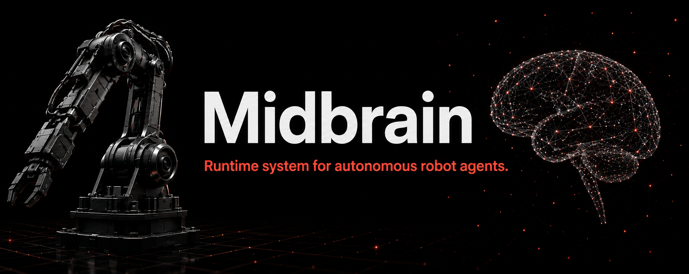

# Midbrain

**An agentic runtime for autonomous, interoperable robots**

Midbrain is an experimental framework for building robots that can perceive,
reason, act, verify outcomes, and recover through an agentic workflow. The
current reference system uses an RGB-D camera, visual-inertial localization,
semantic perception, a seven-motor arm, bounded Skills, and an autonomous Agent
to exercise that architecture on real hardware.

The project is under heavy development. It is not a production-certified robot
controller, safety system, or remote operator console. Physical motion remains
subject to hardware limits, deterministic controller checks, scoped authority,
fresh evidence, and explicit safe-stop behavior.

## Aim: autonomous robots without framework lock-in

The goal is not merely to make one arm complete one scripted demonstration.
Midbrain is intended to let a robot accept a higher-level objective, discover
what its installed system can do, gather the observations it needs, choose
bounded operations, execute through guarded control paths, verify the physical
result, and continue or recover with minimal operator interaction.

Autonomy must not require every robot to use the same camera, arm, model
provider, agent SDK, operating system, or perception stack. Midbrain therefore
separates stable semantic contracts from replaceable implementations:

- A camera Provider can be replaced without rewriting every visual Skill.
- An arm Provider can enforce its own hardware limits while exposing a common
  capability boundary.
- A Skill can coordinate several Providers without owning their drivers.
- An Agent can select Skills without receiving unrestricted device APIs.
- Another agent framework can project into Midbrain events and tools without
  changing Manager, Fabric, or controller contracts.
- Simulation, replay, ROS bridges, local models, and hosted models can coexist
  as implementations of explicit capabilities rather than becoming hidden
  platform dependencies.

The intended result is a reusable physical-agent platform: autonomous at the
task level, deterministic at safety-critical boundaries, and portable across
hardware and agent implementations.

## Why this infrastructure is necessary

Agentic robotics combines systems with very different timing, ownership, and
failure behavior. A language model may take seconds to decide; a camera
continuously overwrites frames; a GPU model may need warm residency; a motor
controller must react within a bounded interval; and a browser disconnect must
not erase the true state of a physical action. Directly wiring an Agent to
device APIs makes these differences invisible until they cause stale evidence,
duplicate motion, resource conflicts, or an unsafe loss of control.

Midbrain builds the following infrastructure because autonomy depends on it:

| Infrastructure | Why it exists |
|---|---|
| **Resource Provider Manager** | Discovers capabilities, manages persistent processes and dependencies, coordinates scarce resources, and owns system-level authority and shutdown. |
| **World State Fabric** | Gives components a shared, timestamped view of observations, transforms, identities, revisions, and lineage instead of many private notions of “latest.” |
| **Resource Providers** | Keep hardware drivers and long-lived computation behind stable capability contracts while preserving device-specific enforcement. |
| **Finite Skills** | Turn perception, calibration, planning, and recovery into bounded operations with explicit inputs, outcomes, cleanup, and retry scope. |
| **Control authority and leases** | Ensure that only one valid owner can command a protected physical resource and that expiry, restart, or disconnect leads to a defined safe state. |
| **Preview and authorization lineage** | Bind physical execution to the exact reviewed target, scene, limits, and evidence instead of treating a general approval as arbitrary motion permission. |
| **Timestamped transforms and conventions** | Prevent camera, world, robot, arm-base, tool, and object coordinates from being silently confused. |
| **Evidence and event contracts** | Let operators and other Agents inspect what happened without depending on one browser session or one agent SDK's private event types. |
| **Residency and readiness states** | Distinguish a running process from a component that is initialized, healthy, current, and ready for a specific capability. |
| **Recording, replay, and conformance work** | Make failures reproducible and allow outside implementations to prove compatibility without touching hardware. |

This structure adds more boundaries than a single-purpose robot script, but
those boundaries make long-running autonomy, safe recovery, replaceable
hardware, and outside-agent integration tractable.

## Core model

| Concept | Responsibility |
|---|---|
| **Manager** | Provider lifecycle, dependencies, capability discovery, resource coordination, authority, and ordered shutdown. |
| **Fabric** | Timestamped observations, transform relationships, synchronized lookup, shared state, and large-payload references. |
| **Providers** | Persistent hardware or computation services such as cameras, robot controllers, localization, and scene compilation. |
| **Skills** | Finite operations that acquire capabilities, use coherent evidence, produce a structured result, release resources, and end. |
| **Agents** | Interpret objectives, discover Skills, coordinate work, evaluate results, and decide whether to continue, retry, recover, or ask for help. |

The Manager is the control plane; the Fabric is the observation and state
plane. Large images, depth maps, and point clouds remain in shared memory while
the Fabric carries generation-checked references and provenance. Physical
commands remain inside controller-enforced paths rather than passing through
the language model or the Fabric.

### Agent-facing execution granularity

The reference target is one Agent decision per task-facing finite operation,
not one model-selected call per internal API. Manager may satisfy one
task-facing readiness request by ordering and activating the Provider's
declared transitive dependencies. A Skill host may likewise execute a bounded
sequence of mechanically determined internal calls, such as nonphysical
preview, canonical authorization lookup, and exact preview commit, without
returning each intermediate handoff to the model.

This is not a general opaque mega-API. Internal stages retain typed results,
timeouts, evidence, authorization, controller validation, and audit records.
The operation returns to the Agent whenever progress requires another owner,
a semantic decision, Provider recovery, calibration review, re-observation,
replanning, an operator answer, or uncertain physical-outcome handling.
Independent task-facing Skills remain separate operations.

With these host-side handoff mechanics established, remaining latency and
reliability improvements for current robot workflows should normally be made
inside the owning Provider or Skill: Provider initialization and publication,
perception sampling and bounded reselection, controller progress, and
Skill-owned deterministic orchestration. Extra Agent prompting must not be
used to compensate for an owning component's missing readiness or workflow
logic.

See [Architecture and Data Flow](docs/01_ARCHITECTURE_AND_DATA_FLOW.md) for the
runtime flow and [Physical AI Contracts](contracts/README.md) for normative and
working-draft interfaces.

## Current reference system

The repository currently contains:

- Rust Resource Provider Manager and World State Fabric.
- Orbbec Femto Bolt RGB-D/IMU Provider and native CameraHost.
- Local visual-inertial odometry with convention-versioned world frames.
- Semantic scene tracking and an arm-scene compiler.
- Basic reBot/Damiao motor Provider and an Integrated Cartesian controller.
- Finite Skills for initialization, visual localization, spatial
  registration, stationary alignment, profile-driven non-moving VLM
  arm-root translation refinement, no-contact approach, and guarded motion.
- One backend-owned autonomous Agent runtime with regular and developer views,
  normalized events, visual evidence, chat projection, and a local diagnostic
  journal.
- An explicit-only FoundationPose initialization and compatibility route.

Capability maturity is intentionally component-specific. Consult each
Provider's README and validation document before using real hardware. A
capability advertised by a prototype is not a safety certification.

## Spatial and safety boundaries

Midbrain's ordinary three-dimensional language uses world/robot +X forward,
+Y left, and +Z up opposite gravity. Camera optical coordinates remain X
right, Y down, and Z forward. Cross-component spatial values carry explicit
frame, convention, timestamp, epoch, and calibration information. See the
[Spatial Frame Convention](contracts/14_spatial_frame_convention_v2.md).

An Agent decision never replaces:

- controller joint, speed, torque, workspace, and arrival validation;
- collision and semantic-scene checks;
- Manager authority and Provider-local fencing;
- exact preview-bound authorization where required;
- powered support, safe-home, graceful relinquish, and emergency-stop policy;
- physical qualification for the installed robot and workcell.

The UI and command APIs are loopback development surfaces. Do not expose them
remotely until authentication, authorization, transport protection, origin
protection, rate limiting, and audit identity are implemented.

## Setup and entry point

The complete reference hardware path targets Windows 10/11 with Python 3.11,
Rust MSVC, Visual Studio C++ tools, CMake, and the Orbbec SDK. Optional arm and
FoundationPose paths have additional hardware and runtime requirements.

From Developer PowerShell in the repository root:

```powershell
Set-ExecutionPolicy -Scope Process Bypass
.\platform_core\scripts\setup_workspace.ps1
```

For normal use, run `Start Midbrain.cmd`, then enter the portal at
`http://127.0.0.1:7001/`. Opening the portal does not activate Providers or
authorize motion. Use the portal's guarded paths for observation, Agent work,
development controls, and shutdown.

For detailed prerequisites, component setup, recovery, and safe termination,
read [Setup and Operation](docs/03_SETUP_AND_OPERATION.md).

## Documentation

Start at the [Documentation Hub](docs/README.md), which provides separate
paths for operators, framework integrators, component developers, and project
maintainers.

Key references:

- [Architecture and Data Flow](docs/01_ARCHITECTURE_AND_DATA_FLOW.md)
- [Setup and Operation](docs/03_SETUP_AND_OPERATION.md)
- [Compatibility and Extension Guide](docs/05_COMPATIBILITY_AND_EXTENSION.md)
- [Validation](docs/06_VALIDATION.md)
- [Configuration and Security](docs/07_CONFIGURATION_AND_SECURITY.md)
- [Current Limitations and Roadmap](docs/09_LIMITATIONS_AND_ROADMAP.md)
- [Gripper-Motion Arm-Root Alignment](docs/13_GRIPPER_MOTION_ARM_ROOT_ALIGNMENT.md)
- [Refine Arm-Root Translation Skill](skills/refine-arm-root-translation/SKILL.md)
- [Physical AI Contracts](contracts/README.md)

Release history belongs in [CHANGELOG.md](CHANGELOG.md). Component-specific
installation, APIs, safety constraints, and validation remain beside their
implementations. Completed phase handovers and temporary task notes are
retired from the active tree; Git history preserves them when historical
investigation is required.

## Repository layout

| Path | Purpose |
|---|---|
| `platform_core` | Manager, Fabric, and workspace lifecycle scripts |
| `contracts` | Framework-neutral contracts and schemas |
| `providers` | Persistent hardware and computation services |
| `skills` | Finite task-oriented operations |
| `test_agent` | Reference autonomous Agent adapter and UI |
| `config` | Local configuration ownership and sanitized templates |
| `docs` | Active framework, operator, integration, validation, and roadmap documentation |

## Validation and contribution

Run the repository validation entry point from Developer PowerShell:

```powershell
.\scripts\validate.ps1
```

Hardware-specific acceptance remains separate from stopped software
validation. See [Validation](docs/06_VALIDATION.md) and each component's
`VALIDATION.md` before interpreting a passing software suite as physical
qualification.

Contributions should preserve capability-based interfaces, explicit spatial
frames, bounded Skills, Provider-local enforcement, coherent Fabric evidence,
safe cleanup, and replaceable agent integrations. See
[CONTRIBUTING.md](CONTRIBUTING.md) and the
[Compatibility and Extension Guide](docs/05_COMPATIBILITY_AND_EXTENSION.md).

## License

Original Midbrain code is licensed under the [MIT License](LICENSE). Bundled or
optional third-party software, model checkpoints, and CAD-derived assets retain
their own licenses and restrictions. Review [Third-Party Notices](THIRD_PARTY_NOTICES.md)
and package-local notices before redistribution or commercial use.
